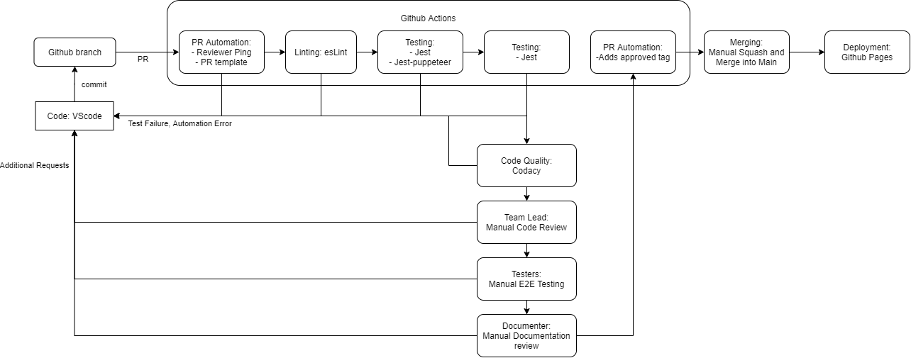

Our CI/CD build system will be implemented in stages as our code base is built - in this way, our pipeline can better accomodate the codebase decisions of our developers (i.e. build and test scripting will aim to match and accomodate the growing needs backend's and frontend's decisions/needs). Some exceptions include Documentation automation as this is something that helps the project as a whole and is best implemented ahead fo time.

Here is our current planned pipline (includes merged items, and implemented in-progress items):

## Merged/Implemented
- Linting - Merged in Master; we used eslint since it's reports are easy to inpterpret, our developers can use a built in fix script, and it's wide array of tools allow for fine tuning the rules

- Pull Request Automation - Merged into Master; We will be using Github actions to automatically add code owners (team leads) as code reviewers to every pull request to streamline the PR process. We also have an action to mark a PR as approved once two review approvals have been made (these whould be the team leads). Also added templates so that developers can target relevant information needed in PR.

- Unit Test Automation (backend) - Merged into Master; We are looking to use jest as it can be quickly integrated through npm and has support from the CSE 110 - likely on to be implemented on experimental branch. It also allows for modular use in our pipeline where tests can be created independantly from the main code base and reduces the need to overhaul the pipeline for new tests.

- Documentation - We used JSdoc since the benefit of automatic documentation will greatly reduce the overhead near the end of the project and will generally increase code readability and give a reference for our developers.

- Code Quality - We are using "codacy" to supplement our linting features and allow us to quickly analyze the structure of our code and keep the system clean as a whole.

- Deployment - We decided to use GitHub pages for it's frictionless use and support given through the past labs. Heroku was considered but it seemed too much trouble for too little time.

## In Progress

## Backlog

## Closed
- Logging - We were iff-y on the need for this right now cause our developers arent as close to this need (major overkill). With the time we had left, we saw logging as too much for the deadline but something we might've revisit later gven more time.

- Error Tracking - We were iff-y on the need for this right now cause our developers haven't needed much for full blown error handling. With the time we had left, we saw implementing an error tracker as too much for the deadline but something we might've revisit later given more time.

- Unit Test Automation (frontend) - We are looking to use jest-puppeteer as it can be quickly integrated through npm and has support from the CSE 110 - likely on to be implemented on experimental branch. After more exploratory programming, we ultimately scrapped the idea in favor to manual testing due to time and the rough integratability problems with our system.